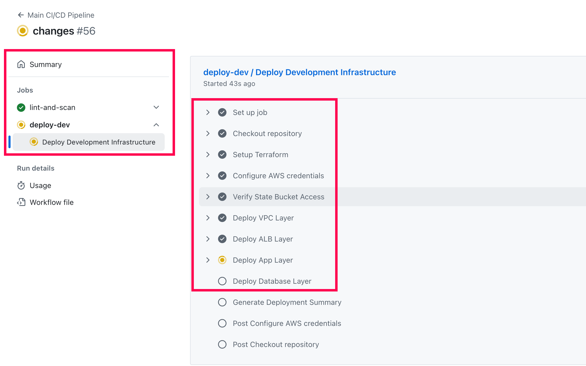
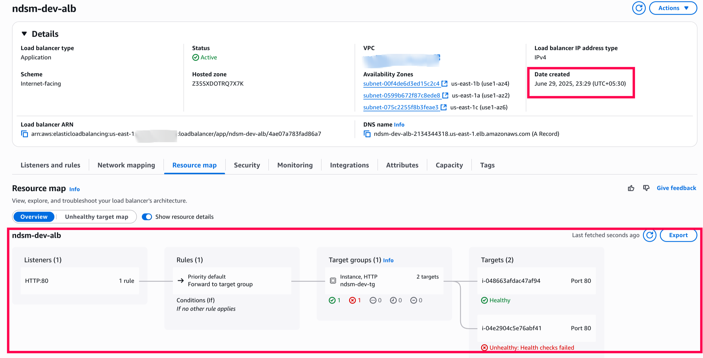

# AWS Multi-Tier Infrastructure Platform

Streamlined infrastructure deployment with Terraform IaC, GitHub Actions CI/CD, and built-in security best practices across environments. Extensible to deploy multi-environment infrastructure across AWS accounts.

## Table of Contents

1. [Overview](#overview)
2. [Repository Structure](#repository-structure)
3. [Key Features Implemented](#key-features-implemented)
4. [Cost Optimization Opportunities](#cost-optimization-opportunities)
5. [Enhancement Opportunities (WIP)](#enhancement-opportunities-wip)
6. [Challenges Faced](#challenges-faced)
7. [Prerequisites](#prerequisites)
8. [Demo](#demo)
   - [Environment Configuration](#environment-configuration)
   - [GitHub Actions Pipeline Stages](#github-actions-pipeline-stages)
   - [AWS Terraform Modules Deployed](#aws-terraform-modules-deployed)
   - [Infrastructure Resources Created](#infrastructure-resources-created)

## Overview


The CI/CD pipeline follows a sequential execution model: Lint/Scan → Dev → Staging → Production. 

Each stage must complete successfully before the next begins, ensuring quality gates and preventing broken deployments from propagating through environments.

## Repository Structure

```
.
├── .github/workflows/          # GitHub Actions CI/CD orchestration
│   ├── main.yml               # Main orchestrator workflow
│   ├── lint-and-scan.yml      # Security and quality gates
│   ├── deploy-*.yml           # Environment-specific deployments
│   └── terraform-destroy.yml  # Infrastructure cleanup workflow
│
├── .checkov/                  # Custom security policies
│   └── terraform-custom-policies.yaml    # Organization-specific compliance rules
│
├── bootstrap/                 # Initial setup and OIDC configuration
│   ├── README.md             # Detailed setup instructions
│   ├── tooling/              # S3 backend for TF statefiles and KMS setup
│   └── environment/          # OIDC providers and IAM roles
│
├── modules/                   # Reusable Terraform modules
│   ├── vpc/                  # Network/VPC layer
│   ├── alb/                  # ALB layer
│   ├── app/                  # Application layer
│   └── db/                   # Database layer
│
└── environments/             # Environment-specific configurations
    ├── dev/                  # Development
    ├── staging/              # Staging
    └── prod/                 # Production
```

## Key Features Implemented

1. **Security-First Approach & DevSecOps Culture**
   - ✅ **Shift-left security**: Security safeguards embedded at the beginning of CI/CD pipeline (Lint/Scan stage)
   - ✅ OIDC authentication replaces IAM access keys for secure, temporary credentials
   - ✅ Dedicated IAM roles per environment with least-privilege access
   - ⚠️ Custom Checkov policies defined but currently disabled in pipeline (for demo/testing purposes)
   - ✅ **Security scanning**: Terraform fmt/validate, Checkov (Policy as Code), and TruffleHog (Secrets scanner) run before any deployment

2. **Modular Design**
   - ✅ Each infrastructure layer (VPC, ALB, App, DB) deployed via separate modules. Referenced available TF modules from the Terraform Registry.
   - ✅ Cross-layer references provide loose coupling between components (using Terraform data sources)
   - ✅ Environment isolation achieved with separate state files per layer and environments in different folders
   - ✅ Independent lifecycle management for each layer

3. **GitHub Actions CI/CD Pipeline**
   - ✅ Reusable workflows for modular CI/CD operations
   - ✅ **Terraform-specific validation**: Terraform fmt/validate, plan, and apply stages
   - ✅ Environment-specific deployment workflows with proper job dependencies
   - ✅ Environment-specific secrets stored in GitHub Actions (e.g., AWS IAM Role ARNs, Terraform state bucket names)

4. **Multi-AZ Architecture**
   - ✅ VPC with 3×3 subnet design deployed across 3 availability zones
   - ✅ Network segmentation:
     - Public subnets for ALB (internet-facing load balancer)
     - Private subnets for application servers (no direct internet access)
     - Database subnets for RDS instances (isolated from internet)
   - ✅ Multi-AZ RDS deployment for high availability and automatic failover
   - ✅ NAT Gateways in each AZ for redundant internet access

5. **Security & Compliance**
   - ✅ VPC Flow Logs with KMS encryption and configurable retention
   - ✅ KMS encryption for RDS and CloudWatch Logs (EBS encryption relies on account defaults)
   - ✅ IMDSv2 enforcement on EC2 instances for metadata security
   - ✅ SSL/TLS enforcement for database connections
   - ✅ Deletion protection enabled for production RDS and ALB resources

6. **Monitoring & Operations with Governance**
   - ✅ Auto Scaling Groups with CloudWatch alarms for CPU-based scaling
   - ✅ RDS Performance Insights enabled for production environments
   - ✅ Automated database backups with environment-specific retention periods
   - ✅ **Comprehensive tagging strategy**: Enforces governance through standardized tags enabling cost attribution, resource filtering by project/product, and custom automation capabilities
   - ✅ Module dependency management with proper resource references

## Cost Optimization Opportunities

### 1. Network Costs
- **VPC Endpoints**: Add S3 and DynamoDB VPC endpoints to eliminate NAT Gateway data transfer costs
- **Single NAT Gateway**: Use one NAT Gateway instead of three for non-production environments
- **CloudWatch Logs Retention**: Set appropriate log retention periods (7 days dev, 30 days staging, 90 days prod)

### 2. Compute Optimization
- **Graviton Instances**: Migrate to ARM-based EC2 Graviton servers as they offer cheaper compute costs
- **Fargate for Containers**: Use AWS Fargate for ECS and EKS wherever possible to eliminate EC2 instance management overhead and get more granular, pay-per-use pricing
- **Scheduled Scaling**: Implement time-based scaling to shut down dev/staging environments during weekends
- **AWS Compute Optimizer**: Use to identify over-provisioned EC2 instances and right-size workloads

### 3. Storage Optimization
- **gp3 EBS Volumes**: Upgrade from gp2 to gp3 volumes for better cost-performance ratio
- **EBS Snapshot Lifecycle**: Implement automated snapshot deletion after 30 days for dev, 90 days for staging
- **S3 Storage Tiering**: Implement S3 Lifecycle policies or S3 Intelligent Tiering for application data/logs
- **RDS Storage Autoscaling**: Enable storage autoscaling to avoid over-provisioning

### 4. Database Optimization
- **Reserved Instances**: With predictable, steady-state usage, RDS Reserved Instances can provide savings
- **Backup Retention**: Reduce backup retention to 7 days for dev, 14 days for staging

### 5. Automation & Optimization
- **Lambda Resource Cleanup**: Deploy Lambda functions to automatically identify and delete orphaned resources (unused EIPs, unattached EBS volumes, idle load balancers)
- **Cost Anomaly Detection**: Enable AWS Cost Anomaly Detection for automated spending alerts

### 6. Monitoring & Alerting
- **Governance Through Tagging**: Comprehensive standardized tags enable cost allocation by project/product, automated resource management, and compliance tracking
- **Unused Resource Detection**: Regular audits for idle load balancers, unattached EBS volumes
- **Establish FinOps Culture**: Implement cost awareness and optimization practices across teams

## Enhancement Opportunities (WIP)

- Parameter Store integration for configuration management (currently using environment-specific tfvars files)
- Explicit EBS encryption configuration (currently relies on account defaults)
- Add Terraform `prevent_destroy` lifecycle rules for critical resources
- Manual approval based workflow for production environment deployment
- Pin GitHub Actions versions with commit hash rather than tags for enhanced security
- SNS-based alerting for deployment failures
- Resolve Checkov skip checks to eliminate security exceptions and improve compliance posture

## Challenges Faced

- OIDC configuration complexity with GitHub trust relationships
  - [GitHub Actions Update on OIDC Integration with AWS](https://github.blog/changelog/2023-06-27-github-actions-update-on-oidc-integration-with-aws/) was helpful
- GitLeaks licensing requirements led to choosing TruffleHog for secrets scanning

## Prerequisites

- Basic knowledge of Terraform, GitHub Actions, and AWS
- Complete setup instructions available in the [bootstrap README](bootstrap/README.md)


## Demo

This section showcases the different stages of the GitHub Actions CI/CD pipeline and the AWS resources created through the Terraform modules.

### Environment Configuration

| Environment | VPC CIDR    | EC2 Type  | RDS Type     | Auto Scaling |
|-------------|-------------|-----------|--------------|-------------|
| Development | 10.0.0.0/16 | t3.micro  | db.t3.micro  | 1-2 (1)     |
| Staging     | 10.1.0.0/16 | t3.small  | db.t3.small  | 2-4 (2)     |
| Production  | 10.2.0.0/16 | m5.large  | db.r5.large  | 3-10 (3)    |

### GitHub Actions Pipeline Stages

- **Pipeline Execution**: The CI/CD pipeline executes through distinct stages as shown below:
  
  
  
  Sequential execution model with stages:
  1. **Lint and Scan**: Security and quality checks using Terraform fmt/validate, Checkov, and TruffleHog
  2. **Development**: Automated deployment to dev environment after successful validation
  3. **Staging**: Deployment to staging environment following dev success
  4. **Production**: Deployed automatically after staging is successfully deployed

- **Lint and Scan Stage Details**:
  
  
  
  The lint and scan stage provides security and quality gates before any deployment begins.

### AWS Terraform Modules Deployed

- **Infrastructure Organization**: Modular approach with separate modules for VPC, ALB, Application, and Database layers, enabling independent lifecycle management and easier troubleshooting.

### Infrastructure Resources Created

- **Key AWS Resources**: Created by Terraform modules:
  
  **Application Load Balancer:**
  
  
  Internet-facing Application Load Balancer with target groups and health checks integrated with Auto Scaling Groups.
  
  **RDS Database with Tagging:**
  
  
  Multi-AZ RDS instance with comprehensive tagging strategy for consistent cost allocation and resource management across infrastructure components.